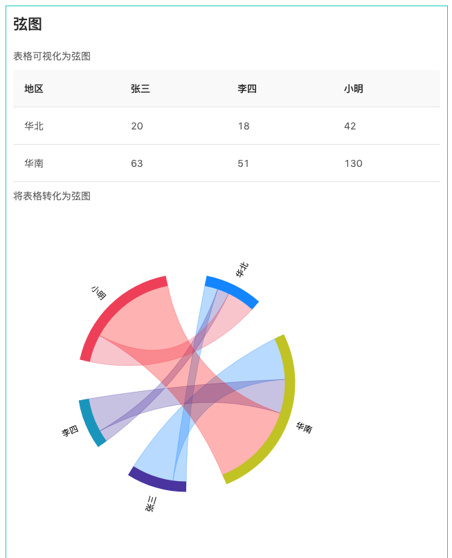
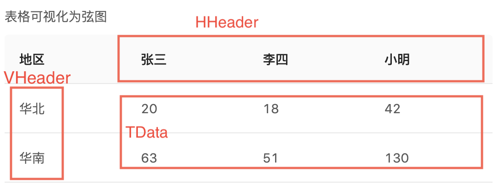

# cr-xian

react component based on antV, for table data visualization

表格数据可视化为弦图


## ✨ Example View


##  📦 Installation
```jsx
cnpm install --save cr-xian
or 
npm install --save cr-xian
```

## 🔨 Usage


```js
import React, { PureComponent } from 'react';
import Xian from 'cr-xian';

```

## 💡 Api


##  Development

```
cnpm install
npm start
```

## Example

http://localhost:8018/examples/testOne.html

## Test
  ```js
  npm test
  
  npm run coverage
  ```


## License

MIT
