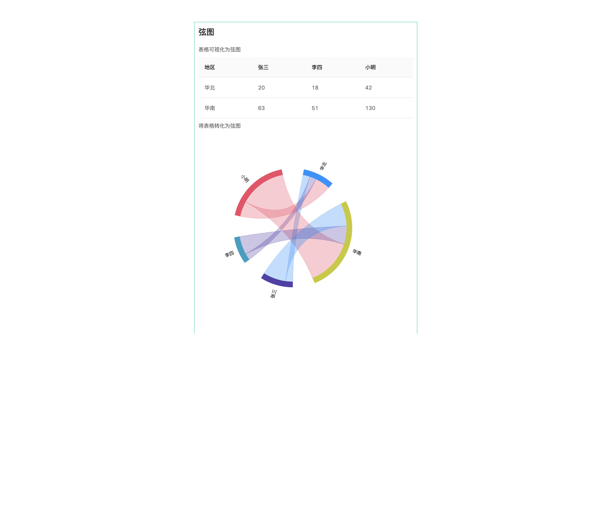

# cr-xian

react component based on antV, for table data visualization

表格数据可视化为弦图


## Example


## Usage
```jsx
cnpm install --save cr-xian
```

## API

## Development

```
cnpm install
npm start
```

## Example

http://localhost:8018/examples/testOne.html

## Test
  ```js
  npm test
  
  npm run coverage
  ```


## License

MIT
